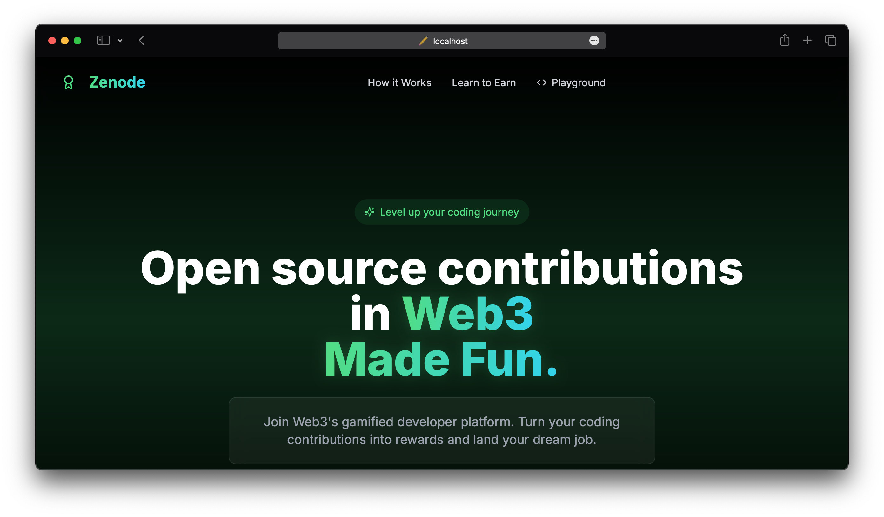
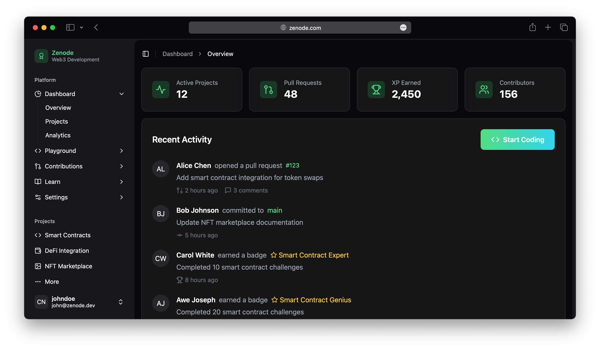
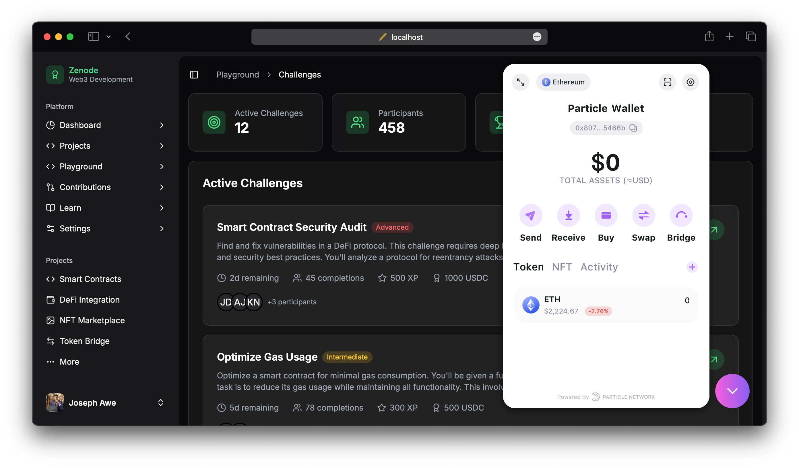
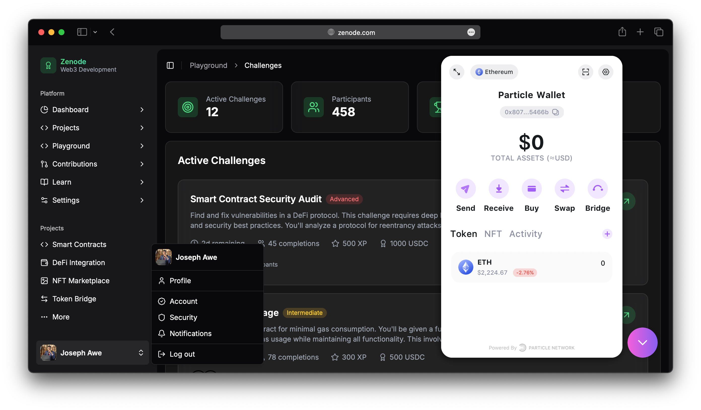
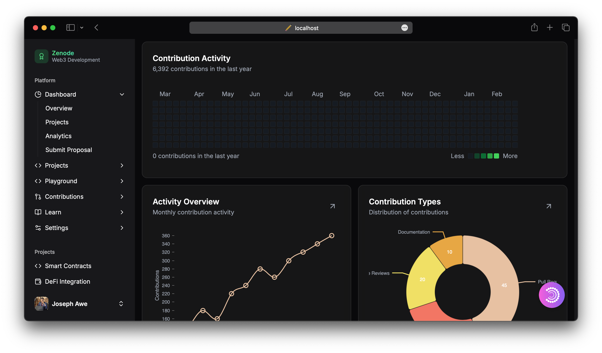
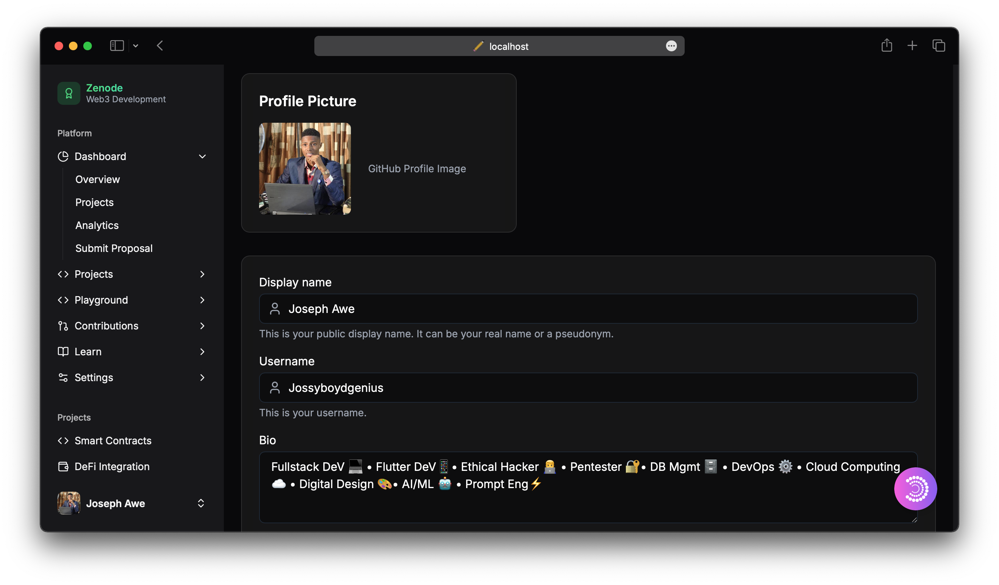

# Zenode - Next-Gen Blockchain Development Platform

<!--  -->

## Overview

Zenode is a gamified Web3 development platform that transforms blockchain coding into an engaging and rewarding experience. The platform connects developers with real-world blockchain projects, allowing them to earn rewards, gain experience, and build their portfolio through contributions to open-source Web3 initiatives.

## Screenshots

Here's a visual tour of the Zenode platform:

### Landing Page

*The Zenode welcome page showcasing the platform's main features*

### Dashboard

*User dashboard with activity metrics and project overview*

### Challenges

*Browse and select from various blockchain coding challenges*

### Active Challenges

*View your current active challenges and progress*

### Activity Overview

*Track your contributions and coding activity*

### Profile

*User profile with achievements and statistics*

## Features

### 🎮 Gamified Learning Experience
- **XP & Leaderboards**: Earn experience points for every contribution and compete with developers worldwide
- **Daily Streaks**: Maintain your coding streak and earn bonus rewards for consistent contributions
- **Loot Boxes**: Unlock special rewards and badges for achieving milestones and completing challenges

### 💻 Interactive Playground
- **Smart Contract Development**: Write, test, and deploy smart contracts in a sandbox environment
- **Web3 Integration**: Experiment with blockchain interactions and dApp development
- **Coding Challenges**: Solve real-world blockchain problems with guided challenges

### 🏆 Skill Development
- **Tutorials**: Step-by-step guides for blockchain development concepts
- **Challenges**: Practical exercises to test and improve your skills
- **Resources**: Curated learning materials for Web3 developers

### 🌐 Community Contributions
- **Open Source Projects**: Contribute to real blockchain projects
- **Pull Requests**: Submit code improvements and fixes
- **Rewards**: Earn tokens and recognition for valuable contributions

## Tech Stack

- **Frontend**: Next.js, React, TypeScript, TailwindCSS
- **UI Components**: shadcn/ui
- **Authentication**: Particle Network Auth
- **Blockchain Integration**: Web3.js/Ethers.js
- **Version Control**: GitHub API integration via Octokit

## Getting Started

### Prerequisites

- Node.js 18 or higher
- npm or yarn

### Installation

1. Clone the repository:
```bash
git clone https://github.com/yourusername/zenode.git
cd zenode
```

2. Install dependencies:
```bash
npm install
# or
yarn install
```

3. Set up environment variables:
Create a `.env.local` file in the root directory with the following variables:
```
NEXT_PUBLIC_GITHUB_APP_ID=your_github_app_id
NEXT_PUBLIC_GITHUB_TOKEN=your_github_token
VITE_PROJECT_ID=your_particle_project_id
VITE_CLIENT_KEY=your_particle_client_key
VITE_APP_ID=your_particle_app_id
```

4. Start the development server:
```bash
npm run dev
# or
yarn dev
```

5. Open [http://localhost:3000](http://localhost:3000) in your browser to see the application.

## Project Structure

```
zenode/
├── public/             # Static assets
├── src/
│   ├── app/            # Next.js app router pages
│   ├── assets/         # Project assets
│   ├── backend/        # Backend API and services
│   ├── components/     # Reusable UI components
│   ├── context/        # React context providers
│   ├── hooks/          # Custom React hooks
│   ├── lib/            # Utility functions
│   ├── pages/          # Additional page components
│   └── styles/         # Global styles
├── .env.local          # Environment variables (create this)
├── next.config.js      # Next.js configuration
└── tailwind.config.js  # Tailwind CSS configuration
```

## Key Features in Detail

### Dashboard
The dashboard provides an overview of your activity, projects, and progress within the platform.

### Playground
The playground offers three main sections:
- **Web3 Integration**: Experiment with blockchain interactions
- **Smart Contracts**: Develop and test smart contracts
- **Challenges**: Solve coding challenges to earn rewards

### Learn
The learning section includes:
- **Tutorials**: Guided lessons on blockchain development
- **Challenges**: Practical exercises with increasing difficulty
- **Resources**: Documentation, articles, and external resources

### Projects
Browse and contribute to various blockchain projects:
- **Smart Contracts**: Security audits and optimization
- **DeFi Integration**: Decentralized finance projects
- **NFT Marketplace**: Non-fungible token implementations
- **Token Bridge**: Cross-chain token transfer solutions

### Contributions
Track your contributions to projects and earn rewards:
- **Issues**: Find and fix bugs in projects
- **Rewards**: View and claim earned rewards

## Deployment

The project is configured for deployment on Vercel or Netlify:

```bash
# Build for production
npm run build
# or
yarn build
```

## Contributing

Contributions are welcome! Please feel free to submit a Pull Request.

1. Fork the repository
2. Create your feature branch (`git checkout -b feature/amazing-feature`)
3. Commit your changes (`git commit -m 'Add some amazing feature'`)
4. Push to the branch (`git push origin feature/amazing-feature`)
5. Open a Pull Request

## License

This project is licensed under the MIT License - see the LICENSE file for details.

## Acknowledgements

- [shadcn/ui](https://ui.shadcn.com/) for the UI components
- [Particle Network](https://particle.network/) for authentication
- [Lucide Icons](https://lucide.dev/) for the icon set
```

This README provides a comprehensive overview of the Zenode platform, including its features, tech stack, and setup instructions. It's structured to give new users and contributors a clear understanding of the project's purpose and functionality.
